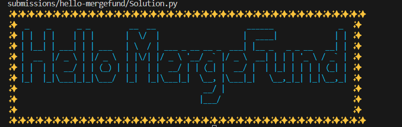
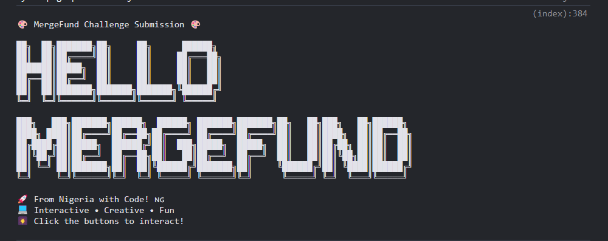

# Hello MergeFund - Creative Challenge Submission 🎉

## 🚀 Project Overview

An interactive, animated web experience that displays **"Hello MergeFund"** with creative visual effects, representing the spirit of **Nigerian developers** in the global tech community.



<video controls src="2025-07-05 23-50-41.mp4" title="Title"></video>

---

## ✨ Features

- **Animated Text**: Scaling and typing effects for "Hello MergeFund"
- **Code Rain**: Falling programming characters as background
- **Interactive Fireworks**: Click to trigger celebration effects
- **Sparkle Animation**: Continuous sparkle particles on screen
- **Nigerian Pride**: 🇳🇬 Flag representation and cultural flavor
- **Console Art**: Beautiful ASCII art displayed in browser console
- **Responsive Design**: Optimized for both desktop and mobile devices

---

## 🛠️ Technical Implementation

- **Language**: HTML, CSS, JavaScript
- **Libraries**: None (pure vanilla implementation)
- **Animations**: CSS keyframes & JavaScript DOM manipulation
- **Interactivity**: Custom event listeners to trigger effects

---

## 📦 Setup Instructions

### Prerequisites

- A modern web browser (Chrome, Firefox, Safari, Edge)
- No installation or dependencies required

### Running the Project

1. **Clone the repository**

```bash
git clone https://github.com/yourusername/repository-name.git
cd repository-name/submissions/hello-mergefund/yourname/
```

## 📂 Open in Browser

### Option 1: Open the HTML File Directly

Simply locate the `index.html` file and double-click it to open in your browser.

---

### Option 2: Run a Local Server

If you'd prefer a local server for better compatibility:

```bash
python -m http.server 3000
```

## 🎨 Creative Approach

### Why This Is Creative

✅ **Multi-Layered Visual Experience**
Combines animation, interaction, and message delivery — more than just text; it’s an experience.

✅ **Cultural Representation**
Proudly integrates the Nigerian flag 🇳🇬 and developer identity to represent local creativity on a global stage.

✅ **Interactive & Engaging**
Click-to-trigger fireworks and interactive UI elements keep the user engaged and entertained.

✅ **Technical Innovation**
Built entirely with vanilla JavaScript — no external libraries.
Smooth animations and optimized DOM manipulation for seamless performance.

---

## 💡 Design Philosophy

- **Inclusive**: Highlights Nigerian developers as contributors to the global tech ecosystem
- **Engaging**: Uses visual effects like sparkles and fireworks to enhance user experience
- **Professional**: Clean, reusable, and well-structured code
- **Memorable**: Creative ASCII art and interactivity leave a lasting impression

---

## 🌟 Special Features

- **Console Art**: Open browser dev tools to view a custom ASCII "Hello MergeFund" message
- **Mobile Friendly**: Responsive layout with full touch support
- **Optimized Performance**: Lightweight JavaScript and smooth 60fps animations with no external bloat

---

## 🏆 Submission Details

- **Developer**: [Abanikannda Sultan]
- **Location**: Nigeria 🇳🇬
- **Challenge**: Hello MergeFund
- **Date**: 5th of July, 2025
- **Approach**: Interactive animated web experience

---

## 🤝 Connect

- **GitHub**: [devsultan06](https://github.com/devsultan06)
- **Twitter**: [@devsultan06](https://x.com/devsultan06)
